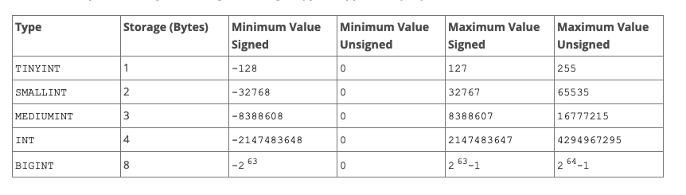

**MySQL**

- **1 General Information | SQL Syntax**
    - [1.2 Typographical and Syntax Conventions
        - () , 一组
        - [] , options
        - | , 枚举， 选一
        - {}， 多选
    - [1.8 MySQL Standards Compliance | extensions | difference | constraints](./mysql/queries/mysql_extensions.sql)
    - [1.8.1 MySQL Standards Compliance extensions](./mysql/queries/mysql_extensions.sql)
    - [1.8.2 MySQL Standards Compliance difference](./mysql/queries/mysql_extensions.sql)
    - [1.8.2 MySQL Standards Compliance constraints](./mysql/queries/mysql_extensions.sql)

- **8 Optimizing**
    - [8.2 Optimizing SQL Statements ](./mysql/optimization/optimization_queries.sql)
        - [8.2.1 Optimizing SELECT Statements | where 易读，避免全表扫 | range ](./mysql/optimization/optimization_sql_statements.sql)
        - [8.2.1 Optimizing SELECT Statements | Index lookup | Index Range Scan | Inner hash join | Nested loop inner join](./mysql/optimization/optimization_sql_statements.sql)
        - [8.2.2 Optimizing Subqueries, Derived Tables, View References, and Common Table Expressions](./mysql/optimization/optimization_queries.sql)
        - [8.2.3 Optimizing INFORMATION_SCHEMA Queries](./readme.md)
        - [8.2.4 Optimizing Performance Schema Queries](./readme.md)
        - [8.2.5 Optimizing Data Change Statements](./readme.md)
        - [8.2.6 Optimizing Database Privileges](./readme.md)
        - [8.2.7 Other Optimization Tips](./readme.md)
    - [8.3 Optimization Indexes]()
        - [8.3.1 How MySQL Uses Indexes | leftmost prefix |](mysql/optimization/optimization_indexes/optimization_indexes.sql)
            - B-trees(PRIMARY KEY, UNIQUE, INDEX, and FULLTEXT)
            - R-trees(spatial data types)
        - [8.3.2 Primary Key Optimization](mysql/optimization/optimization_indexes/optimization_indexes.sql)
        - [8.3.3 SPATIAL Index Optimization](mysql/optimization/optimization_indexes/optimization_indexes.sql)
        - [8.3.4 Foreign Key Optimization](mysql/optimization/optimization_indexes/optimization_indexes.sql)
        - [8.3.5 Column Indexes](mysql/optimization/optimization_indexes/optimization_indexes.sql)
        - [8.3.6 Multiple-Column Indexes](mysql/optimization/optimization_indexes/optimization_indexes.sql)
        - [8.3.7 Verifying Index Usage](mysql/optimization/optimization_indexes/optimization_indexes.sql)
        - [8.3.8 InnoDB and MyISAM Index Statistics Collection](mysql/optimization/optimization_indexes/optimization_indexes.sql)
        - [8.3.9 Comparison of B-Tree and Hash Indexes](mysql/optimization/optimization_indexes/optimization_indexes.sql)
        - [8.3.10 Use of Index Extensions](mysql/optimization/optimization_indexes/optimization_indexes.sql)
        - [8.3.11 Optimizer Use of Generated Column Indexes](mysql/optimization/optimization_indexes/optimization_indexes.sql)
        - [8.3.12 Invisible Indexes](mysql/optimization/optimization_indexes/optimization_indexes.sql)
        - [8.3.13 Descending Indexes](mysql/optimization/optimization_indexes/optimization_indexes.sql)
        - [8.3.14 Indexed Lookups from TIMESTAMP Columns]()
    - [8.4 Optimizing Database Structure | data size | data type | table size | row size]()
    - [8.5 Optimizing for InnoDB Tables]()
    - [8.6 Optimizing for MyISAM Tables]()
    - [8.8 Query Execution Plan]()
    - [8.9 Controlling the Query Optimizer | optimizer hints | index hints | cost]()
    - [8.10 Buffering and Caching]()
    - [8.11 Optimizing Locking Operations | internal lock | table lock | metadata lock | external lock]()

- **9 Language Structure**
    - [9.1 Literal Values | string | numeric | data time | boolean]()
    - [9.2 Schema Object Names]()
    - [9.3 Keywords and Reserved Words]()
    - [9.4 User-Defined Variables]()
    - [9.5 Expressions]()
    - [9.6 Query Attributes]()
- **10 Character Sets, Collations, Unicode**

- **11 Data Types**
    - [11.1 Numeric Data Types INTEGER, INT, SMALLINT, TINYINT, MEDIUMINT, BIGINT | Fixed-Point Types |Floating-Point Types](./mysql/data_types/numeric_type.sql)
    - [11.2 Date and Time Data Types | DATETIME, and TIMESTAMP Types](./mysql/data_types/date_time_type.sql)
    - [11.3 String Data Types | char | varchar | text | enum | set](./mysql/data_types/string_type.sql)
    - [11.4 Spatial Data Types |Geometry Model](./mysql/data_types/data_types.sql)
    - [11.5 The JSON Data Type](./mysql/data_types/json_type.sql)
    - [11.6 Data Type Default Values](./mysql/data_types/data_types.sql)
    - [11.7 Data Type Storage Requirements](./mysql/data_types/data_types.sql)
    - [11.8 Choosing the Right Type for a Column](./mysql/data_types/data_types.sql)

- **12 Functions and Operators**
    - [12.1 Function and Operator Reference]()
    - [12.2 Type Conversion in Expression Evaluation]()
    - [12.3 Operators | logical | comparison](./mysql/functions_and_operators/operators.sql)
    - [12.4 Control Flow Functions]()
    - [12.5 Numeric Functions and Operators]()
    - [12.6 Date and Time Functions]()
    - [12.7 String Functions and Operators]()
    - [12.8 What Calendar Is Used By MySQL?]()
    - [12.9 Full-Text Search Functions]()
    - [12.10 Cast Functions and Operators]()
    - [12.11 XML Functions]()
    - [12.12 Bit Functions and Operators]()
    - [12.13 Encryption and Compression Functions]()
    - [12.14 Locking Functions]()
    - [12.15 Information Functions]()
    - [12.16 Spatial Analysis Functions]()
    - [12.17 JSON Functions]()
    - [12.20 Aggregate (GROUP BY) Functions]()
    - [12.21 Window Functions]()
    - [12.22 Performance Schema Functions]()
    - [12.23 Internal Functions]()
- **13 SQL Statements**
    - **13.1 Data Definition Statements**
        - [database | table ](./mysql/ddl/create_employees.sql)
        - [index](./mysql/optimization/optimization_sql_statements.sql)
        - [trigger | view](mysql/ddl/create_view_dept_emp_lastest_date.sql)
        - [server | spatial ｜event ]()
        - [function | instance]()
    - **13.2 Data Manipulation Statements**
        - [insert | update | delete | select](./mysql/data_types/data_types.sql)
        - [do | import | table |values | with]()
    - **13.3 Transactional and Locking Statements**
        - [START TRANSACTION, COMMIT, and ROLLBACK | savepoint]()
    - **13.4 Replication Statements**
        - [master | slave | group replication]()
    - **13.5 Prepared Statements**
        - [prepare | execute | deallocate | compound | begin ... end | flow control | cursors]()
    - **13.7 Database Administration Statements**
        - [clone | set | show | describe | explain | help | use]()

- **24 Stored Objects**
    - [24.2 Using Stored Routines]()
    - [24.2.4 Stored Procedures, Functions, Triggers, and LAST_INSERT_ID()]()
    - [24.3 Using Triggers]()
    - [24.5 Using Views]()
    - [24.6 Stored Object Access Control]()
    - [24.7 Stored Program Binary Logging]()
    - [24.8 Restrictions on Stored Programs]()
    - [24.9 Restrictions on Views]()
    
- **16 Storage Engines**
  
  
- **17 Replication**
    - [17.1 Configuring Replication]()
    - [17.2 Replication Implementation]()
    - [17.3 Replication Security]()
    - [17.4 Replication Solutions]()
    - [17.5 Replication Notes and Tips]()
- **23 Partitioning**
    - [23.1 Overview of Partitioning in MySQL]()
    - [23.2 Partitioning Types]()
    - [23.3 Partition Management]()
    - [23.4 Partition Pruning]()
    - [23.5 Partition Selection]()
    - [23.6 Restrictions and Limitations on Partitioning]()
- **4 MySQL Programs**
    - [4.5.1 mysql — The MySQL Command-Line Client]()
    - [4.5.2 mysqladmin — Client for Administering a MySQL Server]()
    - [4.5.3 mysqlcheck — A Table Maintenance Program]()
    - [4.5.4 mysqldump — A Database Backup Program]()
    - [4.5.5 mysqlimport — A Data Import Program]()
    - [4.5.6 mysqlpump — A Database Backup Program]()
    - [4.5.7 mysqlshow — Display Database, Table, and Column Information]()
    - [4.5.8 mysqlslap — Load Emulation Client]()
   