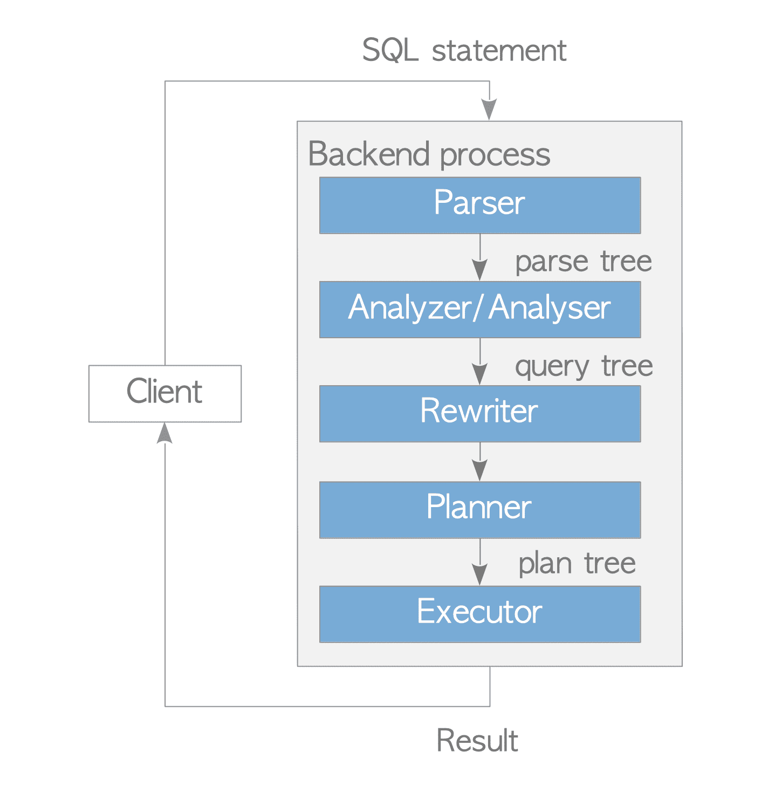

**PostgreSQL**
- **4. SQL Syntax**
   - [4.1. Lexical Structure](./postgresql/migrations/20200815134218_create_sponsor.up.sql)
   - [4.2. Value Expressions | type cast](postgresql/migrations/20200815134218_create_sponsor.up.sql)
- **5. Data Definition**
   - [5.1. Table Basics](./postgresql/migrations/20200815143131_create_showcase_rule.up.sql)
   - [5.2. Default Values](./postgresql/migrations/20200815143131_create_showcase_rule.up.sql)
   - [5.3. Constraints](./postgresql/migrations/20200815143131_create_showcase_rule.up.sql)
   - [5.5. Modifying Tables](./postgresql/migrations/20200815100413_alter_users_add_foreign_key.up.sql)
   - [5.7. Schemas](./postgresql/migrations/20200815143131_create_showcase_rule.up.sql)
   - [5.9. Table Partitioning](./postgresql/migrations/20200816080623_create_user_log.up.sql) | [insert | query](./postgresql/data_manipulation/user_log_inserting_data.sql)
   - [5.10. Other Database Objects]()
   - [5.11. Dependency Tracking]()
- **6. Data Manipulation**
   - [6.1. Inserting Data](./postgresql/data_manipulation/user_log_inserting_data.sql)
   - [6.2. Updating Data](./postgresql/data_manipulation/user_log_inserting_data.sql)
   - [6.3. Deleting Data](./postgresql/data_manipulation/order_insert_update_query.sql)
   - [6.4. Returning Data From Modified Rows]()
- **7. Queries**

   - [7.1. Overview | parser | analyser | rewriter | planner | executor](http://www.interdb.jp/pg/pgsql03.html)
   - [7.2. Table Expressions]()
   - [7.3. Select Lists]()
   - [7.4. Combining Queries]()
   - [7.5. Sorting Rows]()
   - [7.6. LIMIT and OFFSET]()
   - [7.7. VALUES Lists]()
   - [7.8. WITH Queries (Common Table Expressions)](./postgresql/data_manipulation/projects_insert_data.sql)
   - [7.9. Joins ｜ cross join 无on| inner join 有 on | left join left为主｜ right join为主](./postgresql/joins/joins.sql)
   
   
- **8. Data Types**
   - [8.1. Numeric Types | int2,int4,int8 | real,double precision | smallserial, serial, bigserial](postgresql/migrations/20200815134218_create_sponsor.up.sql)
   - [8.2. Monetary Types]()
   - [8.3. Character Types | varchar | char | text](./postgresql/migrations/20200814135132_create_user.up.sql)
   - [8.4. Binary Data Types]()
   - [8.5. Date/Time Types](./postgresql/migrations/20200814135132_create_user.up.sql)
   - [8.6. Boolean Type | true | yes | on | 1]()
   - [8.7. Enumerated Types | order | type safety](postgresql/migrations/20200815121818_create_type_pushstatus.up.sql)
   - [8.8. Geometric Types | point | lines | boxes | polygons | circle]()
   - [8.9. Network Address Types]()
   - [8.10. Bit String Types todo]()
   - [8.11. Text Search Types todo]()
   - [8.12. UUID Type](./postgresql/migrations/20200814135132_create_user.up.sql)
   - [8.13. XML Type todo]()
   - [8.14. JSON Types | input output syntax | reparse ](postgresql/migrations/20200815134218_create_sponsor.up.sql)
   - [8.14. JSONB Types | binary | gin indexing](postgresql/migrations/20200817163700_create_orders.up.sql)
   - [8.15. Arrays | input output syntax | accessing | modify | search  ](./postgresql/migrations/20200817163700_create_orders.up.sql)
   - [8.16. Composite Types]()
   - [8.17. Range Types | input output syntax | GiST and SP-GiST index](postgresql/migrations/20200815143131_create_showcase_rule.up.sql)
   - [8.18. Domain Types todo]()
   - [8.19. Object Identifier Types todo]()
   - [8.20. pg_lsn Type todo]()
   - [8.21. Pseudo-Types todo]()
- **9. Functions and Operators**
   - [9.1. Logical Operators]()
   - [9.2. Comparison Functions and Operators]()
   - [9.3. Mathematical Functions and Operators]()
   - [9.4. String Functions and Operators]()
   - [9.5. Binary String Functions and Operators]()
   - [9.6. Bit String Functions and Operators]()
   - [9.7. Pattern Matching]()
   - [9.8. Data Type Formatting Functions]()
   - [9.9. Date/Time Functions and Operators]()
   - [9.10. Enum Support Functions]()
   - [9.11. Geometric Functions and Operators]()
   - [9.12. Network Address Functions and Operators]()
   - [9.13. Text Search Functions and Operators]()
   - [9.14. XML Functions]()
   - [9.15. JSON Functions and Operators]()
   - [9.16. Sequence Manipulation Functions]()
   - [9.17. Conditional Expressions]()
   - [9.18. Array Functions and Operators]()
   - [9.19. Range Functions and Operators]()
   - [9.20. Aggregate Functions]()
   - [9.21. Window Functions]()
   - [9.22. Subquery Expressions]()
   - [9.23. Row and Array Comparisons]()
   - [9.24. Set Returning Functions]()
   - [9.25. System Information Functions and Operators]()
   - [9.26. System Administration Functions]()
   - [9.27. Trigger Functions]()
   - [9.28. Event Trigger Functions]()
   - [9.29. Statistics Information Functions]()
- **10. Type Conversion**
   - [10.1. Overview]()
   - [10.2. Operators]()
   - [10.3. Functions]()
   - [10.4. Value Storage]()
   - [10.5. UNION, CASE, and Related Constructs]()
- **11. Indexes**
   - [11.1. Introduction](introduction.sql)
   - [11.2. Index Types](https://postgrespro.com/blog/pgsql/3994098)
      - [Hash](https://postgrespro.com/blog/pgsql/4161321)
            
      - [Btree](https://postgrespro.com/blog/pgsql/4161516)
            
      - [GiST | B+ tree | generalized search tree](https://postgrespro.com/blog/pgsql/4175817)
      - [SP-GiST | space generalized search tree](https://habr.com/en/company/postgrespro/blog/446624/)
      - [GIN | Generalized Inverted Index](https://habr.com/en/company/postgrespro/blog/448746/)
      - [RUM | BRIN ](https://habr.com/en/company/postgrespro/blog/452900/)
     
   - [11.3. Multicolumn Indexes](introduction.sql)
   - [11.4. Indexes and ORDER BY](introduction.sql)
   - [11.5. Combining Multiple Indexes](introduction.sql)
   - [11.6. Unique Indexes](introduction.sql)
   - [11.7. Indexes on Expressions](introduction.sql)
   - [11.8. Partial Indexes](introduction.sql)
   - [11.9. Index-Only Scans and Covering Indexes](introduction.sql) 
      - [Index only scan, 最优， select， where , order 都命中index](./postgresql/indexes/b_tree.sql)
      - [Index scan, 第二， where, order命中index](./postgresql/indexes/b_tree.sql)
      - [Partial Index Scan，也是index scan， where, order命中index, 且match the partial index condition](./postgresql/indexes/b_tree.sql)
      - [bitmap heap scan, bitmap index scan, 以下情况都走bitmap index scan](./postgresql/indexes/b_tree.sql)
         - "where分开命中2个index"
         - "相同index但是是or条件"
         - "查询的数据大于pg_relation_size"
      - [sequential scan , 没命中index](./postgresql/indexes/b_tree.sql)
      - [backward_scan]()
      - [Nested Loops join, 命中index, 且是limit数据](http://www.interdb.jp/pg/pgsql03.html) | [sql](./postgresql/indexes/b_tree.sql) 
      - [Hash join, 没有命中index时， 或者无limit，全表join时](http://www.interdb.jp/pg/pgsql03.html) | [sql](./postgresql/indexes/b_tree.sql)
      - [Merge join, 有order by时](http://www.interdb.jp/pg/pgsql03.html)  | [sql](./postgresql/indexes/b_tree.sql)
   - [11.10. Operator Classes and Operator Families]()
   - [11.11. Indexes and Collations](introduction.sql)
   - [11.12. Examining Index Usage](introduction.sql)
   - [Index Obfuscation](./postgresql/indexes/b_tree.sql)
- **12. Full Text Search**
   - [12.1. Introduction]()
   - [12.2. Tables and Indexes]()
   - [12.3. Controlling Text Search]()
   - [12.4. Additional Features]()
   - [12.5. Parsers]()
   - [12.6. Dictionaries]()
   - [12.7. Configuration Example]()
   - [12.8. Testing and Debugging Text Search]()
   - [12.9. GIN and GiST Index Types]()
   - [12.10. psql Support]()
   - [12.11. Limitations]()
- **13. Concurrency Control**
   - [13.1. Introduction | Multiversion Concurrency Control, MVCC | locks | read not conflict write](./postgresql/concurrency_control/concurrency_control.sql)
   - [13.2. Transaction Isolation | read commit | repeatable read | serializable](./postgresql/concurrency_control/concurrency_control.sql)
   - [13.3. Explicit Locking | table-level lock | row-level lock | page-level lock | deadlocks | advisory locks](./postgresql/concurrency_control/concurrency_control.sql)
   - [13.4. Data Consistency Checks at the Application Level]()
   - [13.5. Caveats]()
   - [13.6. Locking and Indexes |  page-level locks]()
   - [13.7. ACID | atomicity | consistency | isolation | durability]()
 
- **14. Performance Tips**
   - [14.1. Using EXPLAIN]()
     - cost - the first value represents the cost at which the node begins execution, while the second value is the estimated cost for when the execution is done
     - rows - the estimated number of rows the node will produce.
     - width - the estimated average row size in bytes for the current node.
     - actual time - similar to the cost attribute, but represents the execution time in seconds
     - rows - the actual number of rows that the node produced.
     - loops - the number of times a node got executed
   - [14.2. Statistics Used by the Planner]()
   - [14.3. Controlling the Planner with Explicit JOIN Clauses]()
   - [14.4. Populating a Database | copy | prepare execute| Remove Indexes then Recreate indexes| create index in existing data | Remove Foreign Key Constraints]()
   - [14.5. Non-Durable Settings]()
- **Internal**
   - [Database Cluster, Databases and Tables](http://www.interdb.jp/pg/pgsql01.html)
   - [Process and Memory Architecture](http://www.interdb.jp/pg/pgsql02.html)
   - [Query Processing](http://www.interdb.jp/pg/pgsql03.html)
   - [Foreign Data Wrappers (FDW) and Parallel Query](http://www.interdb.jp/pg/pgsql04.html)
   - [Concurrency Control](http://www.interdb.jp/pg/pgsql05.html)
   - [VACUUM Processing](http://www.interdb.jp/pg/pgsql06.html)
   - [Heap Only Tuple (HOT) and Index-Only Scans](http://www.interdb.jp/pg/pgsql07.html)
   - [Buffer Manager](http://www.interdb.jp/pg/pgsql08.html)
   - [Write Ahead Logging (WAL)](http://www.interdb.jp/pg/pgsql09.html)
   - [Base Backup and Point-In-Time Recovery (PITR)](http://www.interdb.jp/pg/pgsql10.html)
   - [Streaming Replication](http://www.interdb.jp/pg/pgsql11.html)
- **I. SQL Commands**
   - [ALTER TABLE — change the definition of a table](./postgresql/migrations/20200815100413_alter_users_add_foreign_key.up.sql)
   - [ALTER TYPE — change the definition of a type](postgresql/migrations/20200815130436_alter_type_pushstatus.up.sql)
   - [CREATE FOREIGN DATA WRAPPER — define a new foreign-data wrapper]()
   - [CREATE FOREIGN TABLE — define a new foreign table]()
   - [CREATE FUNCTION — define a new function](./postgresql/migrations/20200814135132_create_user.up.sql)
   - [CREATE GROUP — define a new database role]()
   - [CREATE INDEX — define a new index](./postgresql/migrations/20200815134218_create_sponsor.up.sql)
   - [CREATE TABLE — define a new table](./postgresql/migrations/20200815094424_create_emails.up.sql)
   - [CREATE TABLE AS — define a new table from the results of a query]()
   - [CREATE TRANSFORM — define a new transform]()
   - [CREATE TRIGGER — define a new trigger](postgresql/migrations/20200814135132_create_user.up.sql)
   - [CREATE TYPE — define a new data type](postgresql/migrations/20200815121818_create_type_pushstatus.up.sql)
   - [CREATE USER — define a new database role]()
   - [CREATE USER MAPPING — define a new mapping of a user to a foreign server]()
   - [CREATE VIEW — define a new view](mysql/ddl/create_view_dept_emp_lastest_date.sql)
   - [VALUES — compute a set of rows](./postgresql/data_manipulation/emails_insert_data.sql)
   
**MySQL**
- **1 General Information | SQL Syntax**
   - [1.2 Typographical and Syntax Conventions 
      - () , 一组
      - [] , options 
      - | , 枚举， 选一
      - {}， 多选
   - [1.8 MySQL Standards Compliance | extensions | difference | constraints](./mysql/queries/mysql_extensions.sql)
   - [1.8.1 MySQL Standards Compliance extensions](./mysql/queries/mysql_extensions.sql)
   - [1.8.2 MySQL Standards Compliance difference](./mysql/queries/mysql_extensions.sql)
   - [1.8.2 MySQL Standards Compliance constraints](./mysql/queries/mysql_extensions.sql)
- **9 Language Structure**
   - [9.1 Literal Values | string | numeric | data time | boolean]()
   - [9.2 Schema Object Names]()
- **11 Data Types**
   - [11.1 Numeric Data Types INTEGER, INT, SMALLINT, TINYINT, MEDIUMINT, BIGINT | Fixed-Point Types |Floating-Point Types]()
   - [11.2 Date and Time Data Types | DATETIME, and TIMESTAMP Types](./mysql/data_types/data_types.sql)
   - [11.3 String Data Types | char | varchar | text | enum | set](./mysql/ddl/create_employees.sql)
   - [11.4 Spatial Data Types |Geometry Model](./mysql/data_types/data_types.sql)
   - [11.5 The JSON Data Type](./mysql/data_types/data_types.sql)
   - [11.6 Data Type Default Values](./mysql/data_types/data_types.sql)
   - [11.7 Data Type Storage Requirements](./mysql/data_types/data_types.sql)
   - [11.8 Choosing the Right Type for a Column](./mysql/data_types/data_types.sql)
   - [11.9 Using Data Types from Other Database Engines](./mysql/data_types/data_types.sql)
- **13 SQL Statements**
   - **13.1 Data Definition Statements**
      - [database | table |index](./mysql/ddl/create_employees.sql) 
      - [trigger | view](mysql/ddl/create_view_dept_emp_lastest_date.sql) 
      - [server | spatial ｜event | function | instance]()
   - **13.2 Data Manipulation Statements**
      - [insert | update | delete | select](./mysql/data_types/data_types.sql) 
      - [do | import | table |values | with]()
   - **13.3 Transactional and Locking Statements**
      -  [START TRANSACTION, COMMIT, and ROLLBACK | savepoint]() 
   - **13.4 Replication Statements**
      -  [master | slave | group replication]()
   - **13.5 Prepared Statements**
      -  [prepare | execute | deallocate | compound | begin ... end | flow control | cursors]()
   - **13.7 Database Administration Statements**
      -  [clone | set | show | describe | explain | help | use]()
- **7. Queries**
- **Optimizing**
   - [8.2 Optimizing SQL Statements ](./mysql/optimization/optimization_queries.sql)
      - [8.2.1 Optimizing SELECT Statements | where 易读，避免全表扫 | range ](./mysql/optimization/optimization_queries.sql)
      - [8.2.2 Optimizing Subqueries, Derived Tables, View References, and Common Table Expressions](./mysql/optimization/optimization_queries.sql)
      - [8.2.3 Optimizing INFORMATION_SCHEMA Queries]()
      - [8.2.4 Optimizing Performance Schema Queries]()
      - [8.2.5 Optimizing Data Change Statements]()
      - [8.2.6 Optimizing Database Privileges]()
      - [8.2.7 Other Optimization Tips]()
   - [8.3 Optimization Indexes]()
      - [8.3.1 How MySQL Uses Indexes](mysql/optimization/optimization_indexes/optimization_indexes.sql)
      - [8.3.2 Primary Key Optimization](mysql/optimization/optimization_indexes/optimization_indexes.sql)
      - [8.3.3 SPATIAL Index Optimization](mysql/optimization/optimization_indexes/optimization_indexes.sql)
      - [8.3.4 Foreign Key Optimization](mysql/optimization/optimization_indexes/optimization_indexes.sql)
      - [8.3.5 Column Indexes](mysql/optimization/optimization_indexes/optimization_indexes.sql)
      - [8.3.6 Multiple-Column Indexes](mysql/optimization/optimization_indexes/optimization_indexes.sql)
      - [8.3.7 Verifying Index Usage](mysql/optimization/optimization_indexes/optimization_indexes.sql)
      - [8.3.8 InnoDB and MyISAM Index Statistics Collection](mysql/optimization/optimization_indexes/optimization_indexes.sql)
      - [8.3.9 Comparison of B-Tree and Hash Indexes](mysql/optimization/optimization_indexes/optimization_indexes.sql)
      - [8.3.10 Use of Index Extensions](mysql/optimization/optimization_indexes/optimization_indexes.sql)
      - [8.3.11 Optimizer Use of Generated Column Indexes](mysql/optimization/optimization_indexes/optimization_indexes.sql)
      - [8.3.12 Invisible Indexes](mysql/optimization/optimization_indexes/optimization_indexes.sql)
      - [8.3.13 Descending Indexes](mysql/optimization/optimization_indexes/optimization_indexes.sql)
      - [8.3.14 Indexed Lookups from TIMESTAMP Columns]()
   - [8.4 Optimizing Database Structure | data size | data type | table size | row size]()
   - [8.5 Optimizing for InnoDB Tables]()
   - [8.6 Optimizing for MyISAM Tables]()
   - [8.8 Query Execution Plan]() 
   - [8.9 Controlling the Query Optimizer  | optimizer hints | index hints | cost]()
   - [8.10 Buffering and Caching]()
   - [8.11 Optimizing Locking Operations | internal lock | table lock | metadata lock | external lock]()
- **12 Functions and Operators**
   - [12.1 Function and Operator Reference]()
   - [12.2 Type Conversion in Expression Evaluation]()
   - [12.3 Operators | logical | comparison]()
   - [12.4 Control Flow Functions]()
   - [12.5 Numeric Functions and Operators]()
   - [12.6 Date and Time Functions]()
   - [12.7 String Functions and Operators]()
   - [12.8 What Calendar Is Used By MySQL?]()
   - [12.9 Full-Text Search Functions]()
   - [12.10 Cast Functions and Operators]()
   - [12.11 XML Functions]()
   - [12.12 Bit Functions and Operators]()
   - [12.13 Encryption and Compression Functions]()
   - [12.14 Locking Functions]()
   - [12.15 Information Functions]()
   - [12.16 Spatial Analysis Functions]()
   - [12.17 JSON Functions]()
   - [12.20 Aggregate (GROUP BY) Functions]()
   - [12.21 Window Functions]()
   - [12.22 Performance Schema Functions]()
   - [12.23 Internal Functions]()
- **24 Stored Objects**
   - [24.2 Using Stored Routines]()
   - [24.2.4 Stored Procedures, Functions, Triggers, and LAST_INSERT_ID()]()
   - [24.3 Using Triggers]()
   - [24.5 Using Views]()
   - [24.6 Stored Object Access Control]()
   - [24.7 Stored Program Binary Logging]()
   - [24.8 Restrictions on Stored Programs]()
   - [24.9 Restrictions on Views]()
- **17 Replication**
   - [17.1 Configuring Replication]()
   - [17.2 Replication Implementation]()
   - [17.3 Replication Security]()
   - [17.4 Replication Solutions]()
   - [17.5 Replication Notes and Tips]()
- **23 Partitioning**
   - [23.1 Overview of Partitioning in MySQL]()
   - [23.2 Partitioning Types]()
   - [23.3 Partition Management]()
   - [23.4 Partition Pruning]()
   - [23.5 Partition Selection]()
   - [23.6 Restrictions and Limitations on Partitioning]()
- **4 MySQL Programs**
   - [4.5.1 mysql — The MySQL Command-Line Client]()
   - [4.5.2 mysqladmin — Client for Administering a MySQL Server]()
   - [4.5.3 mysqlcheck — A Table Maintenance Program]()
   - [4.5.4 mysqldump — A Database Backup Program]()
   - [4.5.5 mysqlimport — A Data Import Program]()
   - [4.5.6 mysqlpump — A Database Backup Program]()
   - [4.5.7 mysqlshow — Display Database, Table, and Column Information]()
   - [4.5.8 mysqlslap — Load Emulation Client]()
   
**MongoDB**
   